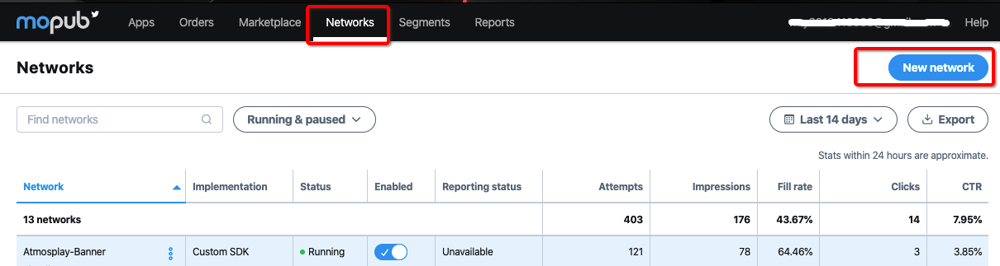
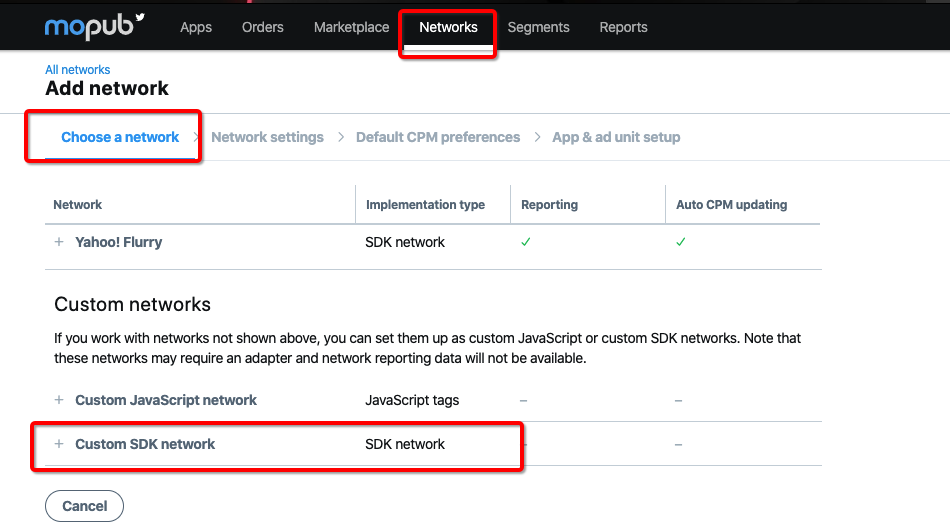
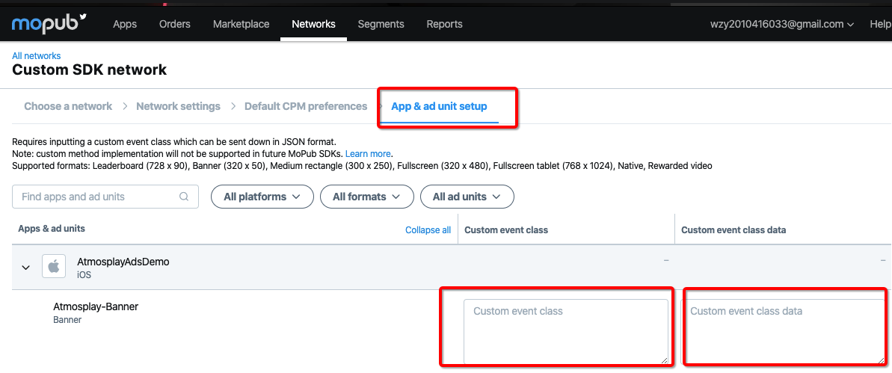

# 概要
本文档描述了如何通过Mopub聚合Atmosplay SDK，目前支持的广告形式有Interstitial、Rewarded Video、Banner。

[See the English integration guide](https://github.com/Atmosplay/MopubAdapter-AtmosplayAds-iOS/wiki)

# 集成前准备
## 入门指南
在将Atmosplay SDK聚合到Mopub之前，请按照以下说明操作：

1. 关于Mopub SDK 集成说明，请参考[Mopub SDK集成文档](https://developers.mopub.com/publishers/ios/)

2. 请仔细阅读Atmosplay [开发者集成文档](https://github.com/Atmosplay/Help-Center-for-Publisher/blob/master/guides.md),其中介绍了如何在Atmosplay创建App ID、AdUnitID。

## 通过CocoaPods集成Mopub-Atmosplay-iOS Adapter

要将该SDK导入iOS项目，最简便的方法就是使用[CocoaPods](https://guides.cocoapods.org/using/getting-started)。

请打开项目的 Podfile 并将下面这行代码添加到应用的目标中：

```
pod 'GoogleMobileAdsMediationAtmosplayAds'
```

然后使用命令行运行：

```
$ pod install --repo-update
```

如果您刚开始接触 CocoaPods，请参阅其[官方文档](https://guides.cocoapods.org/using/using-cocoapods)，了解如何创建和使用 Podfile。

# Mopub后台配置指南

请按照如下步骤进行custom event配置。

1. 选择Networks，然后点击New network。



2. 选择Custom SDK network。



3. 配置类名及参数

   - Atmosplay类名

     - Banner 
     
     ```
     AtmosplayBannerCustomEvent
     ```

     - Interstitial
     
     ```
     AtmosplayInterstitialCustomEvent
     ```

     - RewardedVideo
     
     ```
     AtmosplayRewardedVideoCustomEvent
     ```
   
   - Parameter使用json格式，参数中不能含有空格，注意大小写，具体格式参考下方说明。

   ```
   {"AppID":"YOUR_APP_ID","AdUnitID":"YOUR_ADUNIT_ID"}
   ```



# TestID

| Ad Format     | App_ID                               | Ad_Unit_id                           |
| ------------- | ------------------------------------ | ------------------------------------ |
| RewardedVideo | A650AB0D-7BFC-2A81-3066-D3170947C3DA | BAE5DAAC-04A2-2591-D5B0-38FA846E45E7 |
| Interstitial  | A650AB0D-7BFC-2A81-3066-D3170947C3DA | 0868EBC0-7768-40CA-4226-F9924221C8EB |
| Banner        | A650AB0D-7BFC-2A81-3066-D3170947C3DA | A49521F3-339D-994F-FC80-F9C4170AA0CF |

